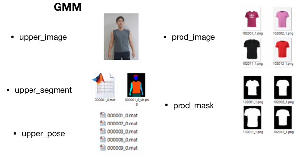

# Everywear Deep Learning Architecture #

## 개요 ##
&nbsp;&nbsp;딥러닝을 통해 옷 이미지를 합성할 때는 다음과 같은 5단계를 거친다.
 

a. <a href="#a">이미지 전처리</a> 
b. <a href="#b">GMM(Geometric Matching Module, CP-VTON)</a> 
c. <a href="#c">EDM(Encoder Decoder Model, VITON-stage1)</a> 
d. <a href="#d">RM(Refinement network Model, VITON-stage2)</a> 
e. <a href="#e">이미지 후처리</a> 

각 Module의 역할은 다음과 같다.
* 이미지 전처리: 옷을 합성하기 위해 필요한 데이터 추출
* GMM: 옷 이미지를 사용자의 사진에 맞게 warping된 warp_prod image 생성
* EDM: 옷 이미지와 사용자 이미지로 GAN을 통해 1차로 합성된 coarse image 생성
* RM : GMM과 EDM에서 나온 결과로 옷의 디테일한 부분을 살리고 자연스럽게 사용자 사진에 합성
* 이미지 후처리: 전신에 더욱 자연스럽게 붙이고 부자연스러운 부분을 제거

따라서 모델의 전반적인 프로세스는 다음과 같다.

 

## a. 이미지 전처리 ##

### 디렉토리 구조 ###
&nbsp;&nbsp;사용자 사진을 받았을 때 현재 생성해야 하는 디렉토리 구조는 다음과 같다.

* input
    - body_images: 사용자 전신 사진
    - body_pose: 사용자 전신 포즈(하의 합성을 위한)
    - body_resized: 256 * 192로 리사이징한 사용자 전신 사진
    - body_segment: 사용자 전신 segment
    - body_pickle: body_images + body_pose + body_resized + body_segment
    - upper_images: 사용자 상체 사진(256 * 192)
    - upper_pose: 사용자 상체 포즈(상의 합성을 위한)
    - upper_segment: 사용자 상체 segment
    - upper_pickle: upper_images + upper_pose + upper_segment
* output
    - composed_images
        + aaaaaa_0_bbbbbb_1_bg.png : 사용자 옷을 합성할 영역을 마스크로 대서 까맣게 만든 이미지
        + aaaaaa_0_bbbbbb_1_fg.png : RM을 거쳐서 나온 합성 사진에서 원하는 합성 부분을 뗀 사진
        + aaaaaa_0_bbbbbb_1_0_pkl.pkl : bg를 pickle화
        + aaaaaa_0_bbbbbb_1_1_pkl.pkl : fg를 pickle화
        + aaaaaa_0_bbbbbb_1_final.png : RM 최종 result
        + aaaaaa_0_bbbbbb_1_mask.png : 
        + aaaaaa_0_bbbbbb_1_sel_mask.png : 음영이 있는 마스크
        + aaaaaa_0_bbbbbb_1_tps.png : gmm(삭제예정)
        + aaaaaa_0_bbbbbb_1_tps_mask.png : gmmask(삭제예정)
    - final_images
        + aaaaaa_0_bbbbbb_1_cccccc_1_final.png
    - final_lower_images
        + aaaaaa_0_bbbbbb_1_final.png
    - final_upper_images
        + aaaaaa_0_bbbbbb_1_final.png
* stage
    - aaaaaa_0_bbbbbb_1.png
    - aaaaaa_0_bbbbbb_1_mask.mat
    - aaaaaa_0_bbbbbb_1_mask.png
    - aaaaaa_0_bbbbbb_1_gmm.png
    - aaaaaa_0_bbbbbb_1_gmmask.png

### 이미지 라벨링 ###

## b. GMM ##

### Input ### 

* upper_image: **256 * 192 * 3**
* upper_segment: upper_body_parsing matlab file (256 * 192)
* upper_pose: 신체의 각 포즈를 잡기 위해 특징점이 기록된 matlab file
* prod_image
    - men_tshirts: 적당한 여백()을 갖고 있는 **256 * 192 * 3** data
    - men_long:
    - men_pants:
* prod_mask: **256 * 192, 8bit**

### Output ###

### Training ###

### Test ###
* GPU 1080ti: 
* CPU: 
### 진행 상황 ###
1. GMM에서 시각화를 위한 코드가 들어가 있는데 이를 빼면 시간이 비약적으로 감소
2. 현재 사용자 요청에 따라 옷이 warping될 수 있도록 구현 및 리팩토링 진행

## c. EDM ##

### input ###
&nbsp;&nbsp;dic의 형태로 저장된 pickle 파일에 모두 들어있으며 내부는 다음과 같다.

* upper_image: **w * h * 3**
* upper_segment: upper_body_parsing matlab file (w * h)
* upper_pose: 신체의 각 포즈를 잡기 위해 특징점이 기록된 matlab file (w * h)
    - GMM과 input 사이즈가 다른 문제가 있다. 이를 통일시켜야 함
* prod_image
### output ###

* stage
    - aaaaaa_0_bbbbbb_1.png: coarse_image
    - aaaaaa_0_bbbbbb_1_mask.png: 합성된 영역의 마스크 이미지
    - aaaaaa_0_bbbbbb_1_mask.mat: 합성된 영역의 마스크 matlab file

### Training ###
### Test ###
### 진행 상황 ###
1. 카테고리 별로 수행할 때 프로세스에 차이가 있다.
    - men_tshirts: prod_segment 대신 gmmask를 사용한다. 이는 gmm이 선행 되어야 한다.
    ~~~python
    warping_cloth_mask = cv2.imread(FLAGS.result_dir_stage1 +
                                  image_name + "_" + product_image_name + "_gmmask.png", 0)
    ret, warp_otsu_mask = cv2.threshold(warping_cloth_mask, 100, 255, cv2.THRESH_BINARY)
    warp_otsu_mask = warp_otsu_mask.astype('float32')
    prod_seg = np.squeeze(prod_segment, axis=2) # 256, 192
    warping_upper_segment = cv2.add(warp_otsu_mask, prod_seg)
    
    warping_upper_segment = np.expand_dims(warping_upper_segment, 2)

    
    model1.images[j-i] = image
    model1.prod_images[j-i] = prod_image
    model1.body_segments[j-i] = body_segment
    model1.prod_segments[j-i] = warping_upper_segment
    model1.skin_segments[j-i] = skin_segment
    model1.pose_raws[j-i] = pose_raw
    ~~~
    - men_long: 
    - men_pants:

## d. RM ##

### input ###

* upper_image: 안 씀
* coarse_image: EDM result
* coarse_mask: EDM result
* warp_prod: GMM result
* prod_image

### output ###

* output
    - composed_images
        + aaaaaa_0_bbbbbb_1_bg.png : 사용자 옷을 합성할 영역을 마스크로 대서 까맣게 만든 이미지
        + aaaaaa_0_bbbbbb_1_fg.png : RM을 거쳐서 나온 합성 사진에서 원하는 합성 부분을 뗀 사진
        + aaaaaa_0_bbbbbb_1_0_pkl.pkl : bg를 pickle화
        + aaaaaa_0_bbbbbb_1_1_pkl.pkl : fg를 pickle화
        + aaaaaa_0_bbbbbb_1_final.png : RM 최종 result
        + aaaaaa_0_bbbbbb_1_mask.png : _mask or _gmmask(men_tshirts)
        + aaaaaa_0_bbbbbb_1_sel_mask.png : 음영이 있는 mask
        + aaaaaa_0_bbbbbb_1_tps.png : warp_prod image
        + aaaaaa_0_bbbbbb_1_tps_mask.png : warp_prod_image에서 mask를 새로 뽑은 마스크(gmmask와 다를 바 없다.)
        ~~~python
        tps_mask = tf.cast(tf.less(tf.reduce_sum(tps_image, -1), 3*0.95), tf.float32)
        ~~~

## e. 이미지 후처리 ##

